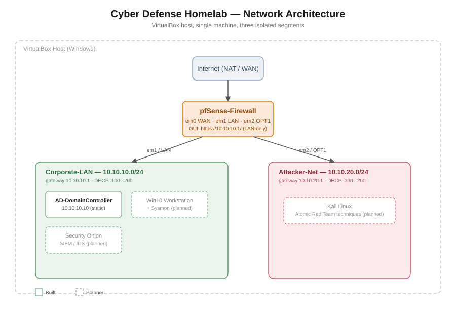

# Cyber Defense Homelab

A self-built virtual lab for practicing blue-team detection and incident response.
The goal: simulate a small corporate network behind a firewall, generate real
attack traffic against it, detect that traffic with a SIEM, and document the
full lifecycle — from network build to written incident reports — as a
portfolio piece.

## Status

🚧 In progress. Firewall and network segmentation are built; domain controller,
workstation, SIEM, and attacker VMs are next.

## Architecture



Two isolated NAT Networks sit behind a pfSense firewall on a single VirtualBox
host:

| Segment | CIDR | Purpose |
|---|---|---|
| Corporate-LAN | 10.10.10.0/24 | "Production" network — domain controller, workstation, SIEM sensor |
| Attacker-Net | 10.10.20.0/24 | Isolated network for the attacker VM (Kali) |

pfSense (`10.10.10.1` on the LAN side) is the only path between the two
segments, so all attacker → target traffic is forced through the firewall
where it can be logged and inspected.

## Tech stack

- **Hypervisor:** VirtualBox 7.2 (host: Windows)
- **Firewall/router:** pfSense (FreeBSD)
- **Domain services:** Windows Server 2022 Evaluation — Active Directory Domain Services
- **Endpoint:** Windows 10 workstation + Sysmon (SwiftOnSecurity config)
- **SIEM/IDS:** Security Onion
- **Attack platform:** Kali Linux
- **Attack simulation:** Atomic Red Team, mapped to MITRE ATT&CK

## Build log

- [x] VirtualBox host prepared, NAT Networks created (`Corporate-LAN`, `Attacker-Net`)
- [x] pfSense firewall deployed and configured (WAN/LAN/OPT1, DHCP on both internal segments)
- [ ] Active Directory domain controller
- [ ] Windows 10 workstation, domain-joined, Sysmon installed
- [ ] Security Onion SIEM/IDS
- [ ] Kali Linux attacker VM
- [ ] Atomic Red Team detection exercises + write-ups

## Repo structure

```
cyber-defense-homelab/
├── README.md
├── architecture/        network diagrams
├── detections/           Sigma rules, alert screenshots
├── incident-writeups/    one folder per simulated attack
└── notes/                ATT&CK mapping, lessons learned
```

## Why this project

Hands-on practice for detection engineering and incident response: building
the environment from scratch, generating real (contained) attack traffic, and
writing up findings the way an analyst would during an actual investigation.
